# AWS S3 Static Website Hosting

## 📌 Project Description

This project demonstrates the use of **Amazon S3** to host a static website and implement basic **data lifecycle management** and **disaster recovery (DR)** strategies.

The project focuses on practical AWS S3 concepts including **static website hosting, lifecycle policies, versioning, data protection, and recovery**.

---

## 🏗️ Architecture

```text
                         Internet
                            │
                            ▼
                    ┌───────────────┐
                    │   Amazon S3   │
                    │    Bucket     │
                    └───────┬───────┘
                            │
             ┌──────────────┼──────────────┐
             │              │              │
             ▼              ▼              ▼
      Static Website   Lifecycle       Disaster
         Hosting       Management      Recovery
                            │              │
                            ▼              ▼
                       Object        Versioning &
                       Lifecycle     Object Recovery
```

---

## 🎯 Objectives

### 1. Host a static website using Amazon S3

Configured an Amazon S3 bucket to host a static website containing HTML, CSS, and other static assets. with versioning enabled to revcover from accedental deletes

**Screenshot:**

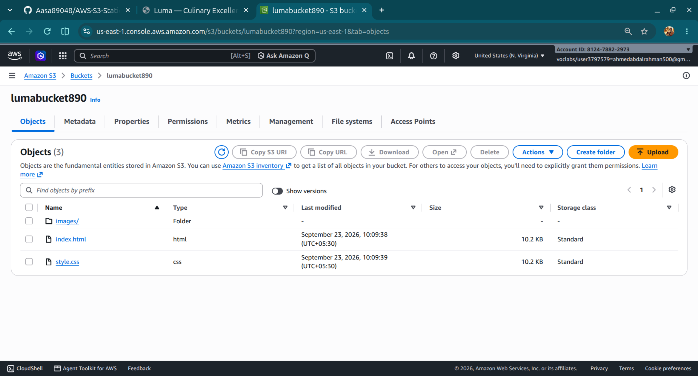
The website
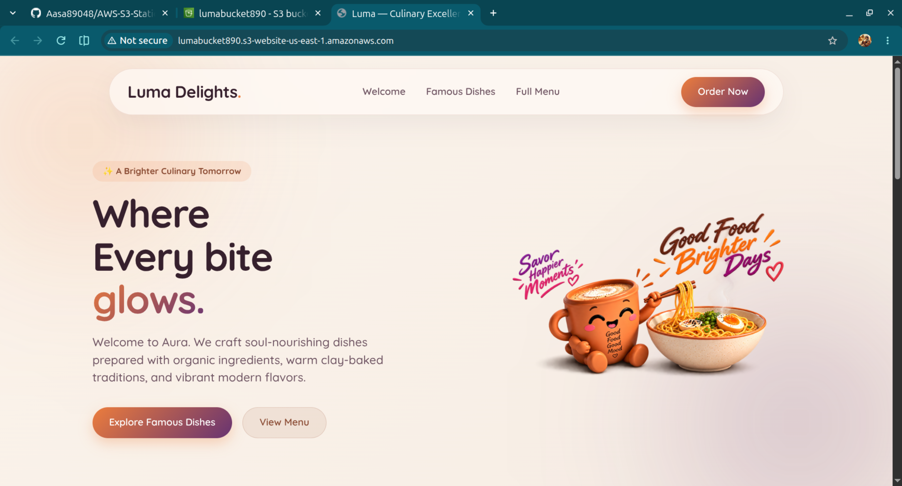


---
### 2. implement versioning 

to protect from accedental deletes and to roll back to previous versions of a website if the update is not optimal for example
uploaded new versionof website
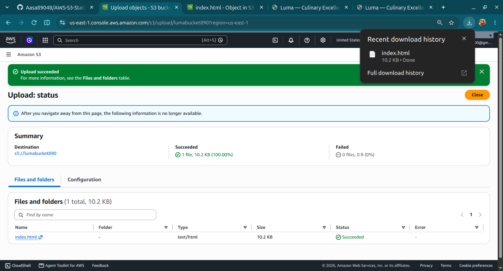
the new version
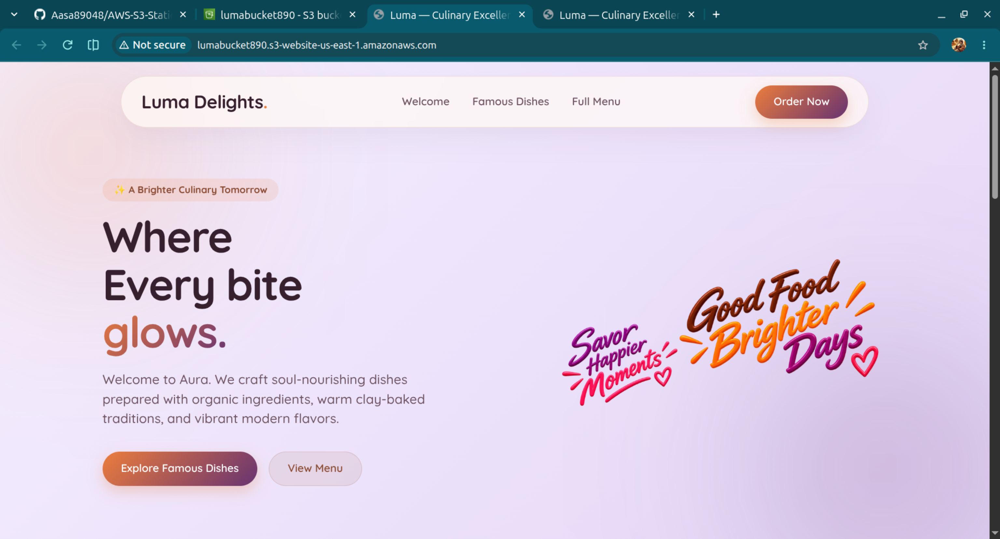
versions in the version tab of an object index.html
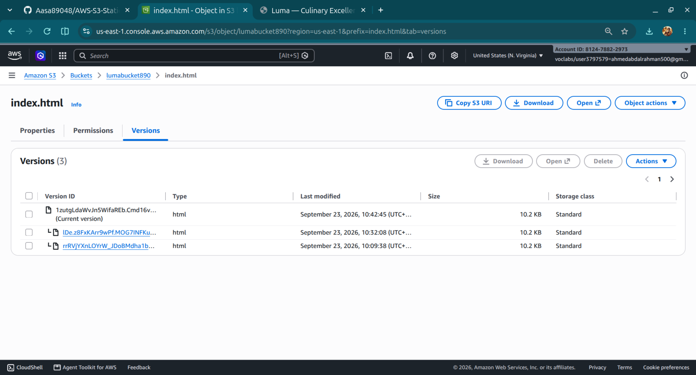

i decided to roll back to the original copy by downloading the old version and uploading it again


### 2. Implement a data lifecycle strategy in Amazon S3

Configured an **S3 Lifecycle Rule** to automatically manage objects according to their lifecycle and optimize storage management.

created a lifecycle to transistion versions of objects to S3-standared-IA
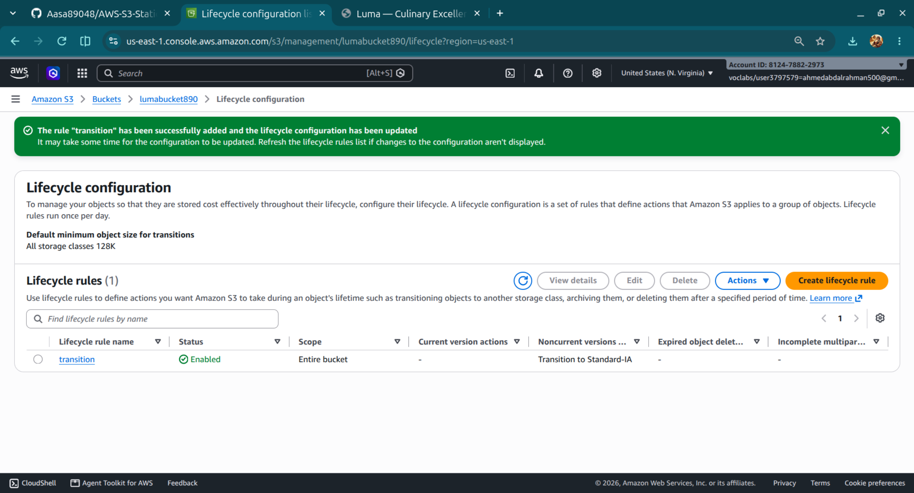
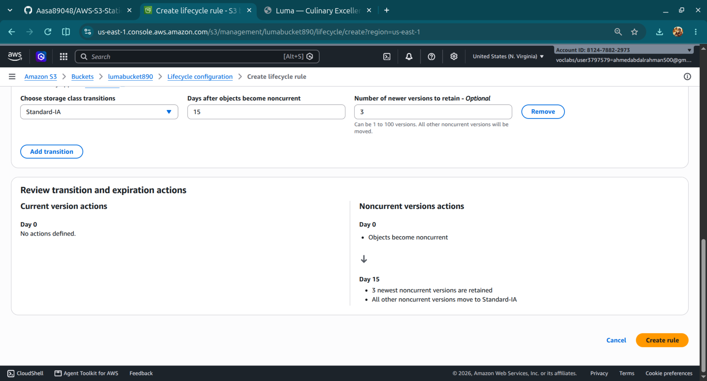
created a lifecycle to delete noncurrent objects 
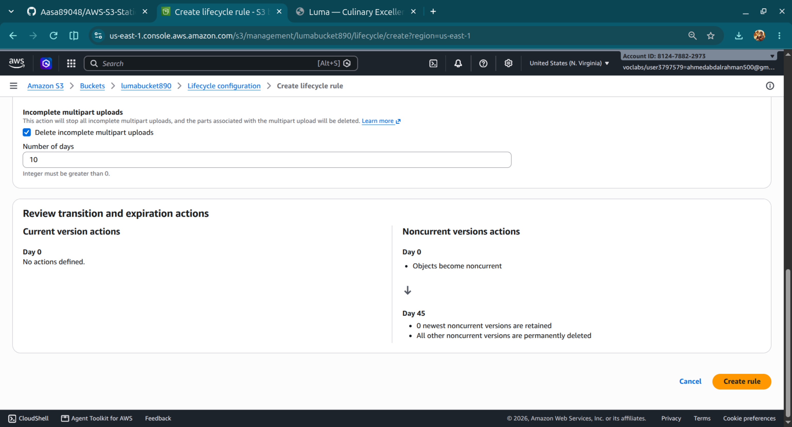
all the lifecycle policies
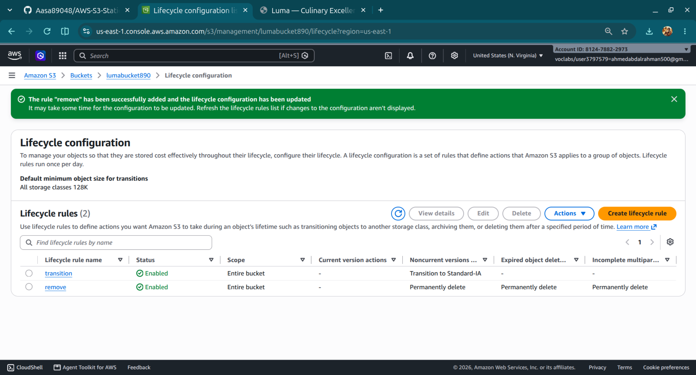


---

### 3. Implement a disaster recovery (DR) strategy in Amazon S3

Enabled **S3 Versioning** in both s3 buckets source and destination 
create the DR bucket in another region
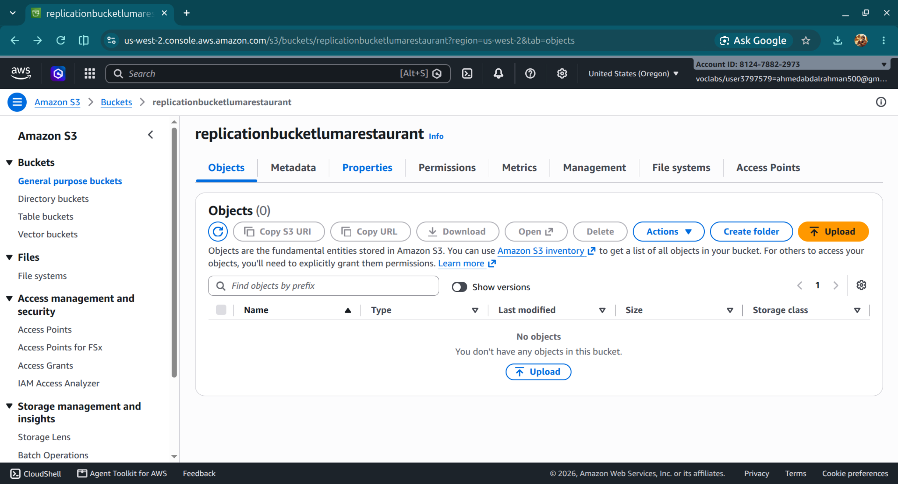
DR bucket with objects newly uploaded to the source so they are replicated here 
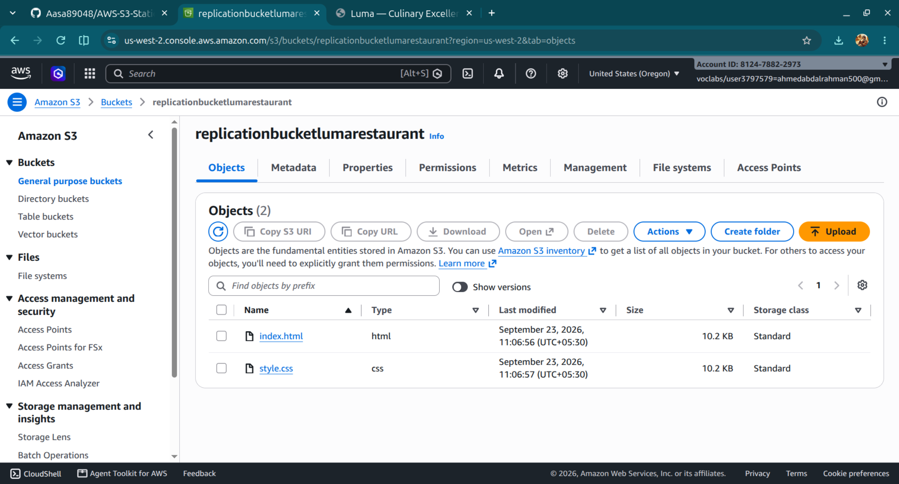
